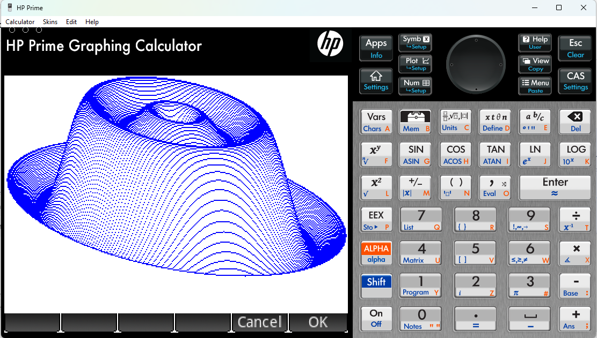

# PrimePyBASIC
PyBasic ported and packaged to run on the HP Prime calculator using the HP Prime MicroPython environment.
# Installation
Download and unzip PrimePyBASIC and drag the PyBASIC.hpappdir folder to the HP Connectivity Kit Content window (bottom left). Start your virtual Prime calculator or physically connect and power on your physical Prime calculator. Once the calculator appears in the HP Connectivity Kit, drag PyBASIC.hpappdir from the Content window to the calculator you wish to install to.
Note, to run large programs (including many of the example games) you will need to increase the PyBASIC heap size from 1Mb to 4Mb.

See the following YouTube video for installation instructions and a demonstration: https://youtu.be/a1LwXHX0U1o

Note: the HP Prime must be running firmware that supports Python (actually MicroPython).

# Usage
The physical Prime MicroPython environment is case sensitive for filenames. When saving or loading programs you can include the filename by itself without the extension (simple) or include the entire filename and extension inside double quotes.

For the simple filename, PyBASIC converts the filename to uppercase and appends the ".bas" extension in lowercase. For the full filename (including extension) the case used within the double quotes is preserved.

This can cause unexpected results (inability to load a file) on a physical Prime vs a virtual Prime calculator. Use the full filename format if in doubt. I may change this functionality in a future update to minimise these differences.

# Additional Commands
The following additional BASIC commands and functions have been implemented to support HP Prime specific functionality.

| Command         | Description |
|-------------|-------------|
| CLS             | Clear screen                           |
| COLOUR( r, g, b)| Set graphic RGB colour (0-255 for each)|
| PSET(x, y)      | Set graphic pixel at (x,y) to current colour               |

Graphic co-ordinates are from top left with 0-319 for X and 0-239 for Y.

Note, when a program ends and the text prompt is printed, the graphics display is lost so use an infinite loop at the end of the program to keep graphics displayed until the program is terminated.

See hat.bas for a sample graphics program (output shown below).

# References
PrimePyBASIC is a port of PyBasic (see https://github.com/richpl/PyBasic) to the HP Prime with changes to support the Prime's MicroPython environment. It is also packaged as an HP Prime application for easy installation on a virtual or physical Prime calculator.
Please see the PyBasic repository for details of the BASIC functionality implemented and examples included.

I have created a separate repository to potentially add Prime specific functionality whereas PyBasic intends to remain non-hardware specific.

Shout out to @richpl for his excellent PyBasic implementation which ported fairly easily to the HP Prime's older and incomplete MicroPython implementation.
